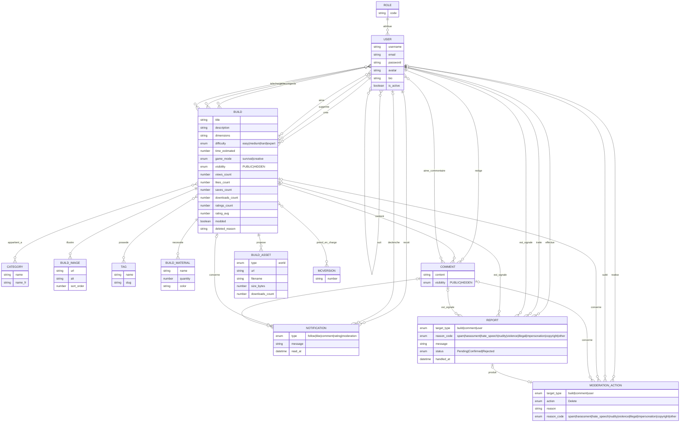

# MCD - Plateforme de partage de builds Minecraft

```mermaid
erDiagram
  USER {
    string username
    string email
    string password
    string avatar
    string bio
    boolean is_active
  }

  ROLE {
    string code
  }

  BUILD {
    string title
    string description
    string dimensions
    enum difficulty "easy|medium|hard|expert"
    number time_estimated
    enum game_mode "survival|creative"
    enum visibility "PUBLIC|HIDDEN"
    number views_count
    number likes_count
    number saves_count
    number downloads_count
    number ratings_count
    number rating_avg
    boolean modded
    string deleted_reason
  }

  CATEGORY {
    string name
    string name_fr
  }

  BUILD_IMAGE {
    string url
    string alt
    number sort_order
  }

  TAG {
    string name
    string slug
  }

  BUILD_MATERIAL {
    string name
    number quantity
    string color
  }

  COMMENT {
    string content
    enum visibility "PUBLIC|HIDDEN"
  }

  BUILD_ASSET {
    enum type "world"
    string url
    string filename
    number size_bytes
    number downloads_count
  }

  MCVERSION {
    string number
  }

  NOTIFICATION {
    enum type "follow|like|comment|rating|moderation"
    string message
    datetime read_at
  }

  REPORT {
    enum target_type "build|comment|user"
    enum reason_code "spam|harassment|hate_speech|nudity|violence|illegal|impersonation|copyright|other"
    string message
    enum status "Pending|Confirmed|Rejected"
    datetime handled_at
  }

  MODERATION_ACTION {
    enum target_type "build|comment|user"
    enum action "Delete"
    string reason
    enum reason_code "spam|harassment|hate_speech|nudity|violence|illegal|impersonation|copyright|other"
  }

  ROLE ||--o{ USER : attribue

  USER ||--o{ BUILD : cree
  USER o|--o{ BUILD : supprime
  USER ||--o{ COMMENT : redige

  BUILD ||--o{ BUILD_IMAGE : illustre
  BUILD ||--o{ BUILD_MATERIAL : necessite
  BUILD ||--o{ BUILD_ASSET : propose
  BUILD ||--o{ COMMENT : contient

  BUILD }o--o{ CATEGORY : appartient_a
  BUILD }o--o{ TAG : possede
  BUILD }o--o{ MCVERSION : prend_en_charge

  USER }o--o{ BUILD : aime
  USER }o--o{ BUILD : sauvegarde
  USER }o--o{ BUILD : note
  USER }o--o{ BUILD : telecharge

  USER }o--o{ COMMENT : aime_commentaire

  USER }o--o{ USER : suit

  USER ||--o{ NOTIFICATION : recoit
  USER o|--o{ NOTIFICATION : declenche
  BUILD o|--o{ NOTIFICATION : concerne
  COMMENT o|--o{ NOTIFICATION : concerne

  USER ||--o{ REPORT : effectue
  USER o|--o{ REPORT : traite
  USER o|--o{ REPORT : est_signale
  BUILD o|--o{ REPORT : est_signale
  COMMENT o|--o{ REPORT : est_signale

  USER ||--o{ MODERATION_ACTION : realise
  USER o|--o{ MODERATION_ACTION : subit
  BUILD o|--o{ MODERATION_ACTION : concerne
  COMMENT o|--o{ MODERATION_ACTION : concerne
  REPORT o|--o| MODERATION_ACTION : produit

```
