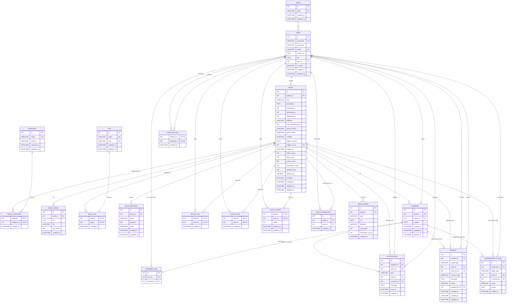

# MCD - Plateforme de partage de builds Minecraft

Ce MCD reflète les entités Doctrine présentes dans `src/Entity`.

## Notes de cohérence avec les entités

- Les identifiants principaux simples sont des `int` auto-générés, pas des `UUID`.
- Les tables `BUILD_LIKE`, `BUILD_SAVE`, `BUILD_RATING`, `BUILD_TAG`, `BUILD_CATEGORY` et `USER_FOLLOW` utilisent une clé primaire composée basée sur leurs relations.
- `COMMENT_LIKE` et `BUILD_DOWNLOAD` possèdent actuellement un `id` technique auto-généré.
- `Build` contient maintenant le booléen `modded`, utile pour distinguer les builds vanilla et moddés.
- `Category` contient `name` et `name_fr`, avec unicité sur `name`.
